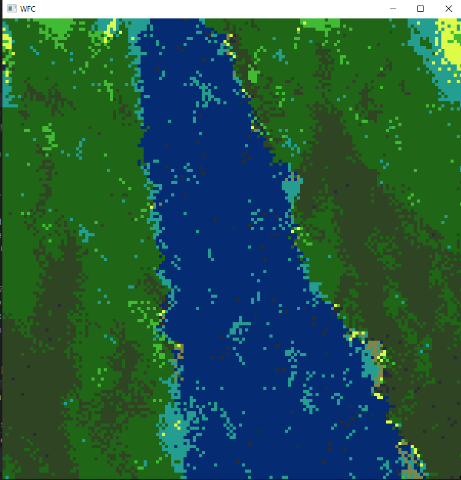

# wave_function_collapse

Wave function Collpase is an algorithm where the image is made of a grid of cells which store their possibilities. Each cell kind can only be next to other cell kinds, like grass can only be next to sand or trees, and water can only touch beach. This leads to some really cool terrain generation, but here I've just coloured in pixels. Feel free to download and fiddle with the rules and biases.

I will mention that for the sake of speed, I've changed the algorithm so this isn't true WFC, but it runs fast enough to generate an image in minutes, not hours.

